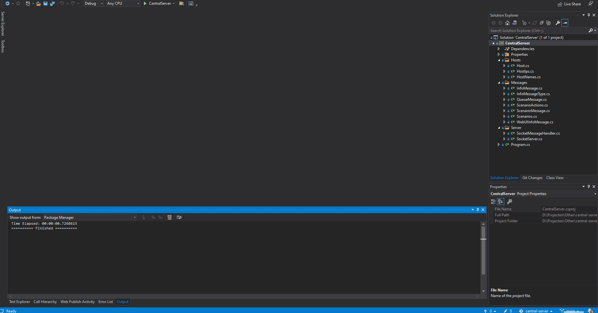

# central-server
## General info
The Central server is the server that routes all websocket connections to the correct hosts.

This server is written in `C# netcore 3.1` with dependencies on `WatsonWebsocket`and `Newtonsoft.Json`.

## Building

